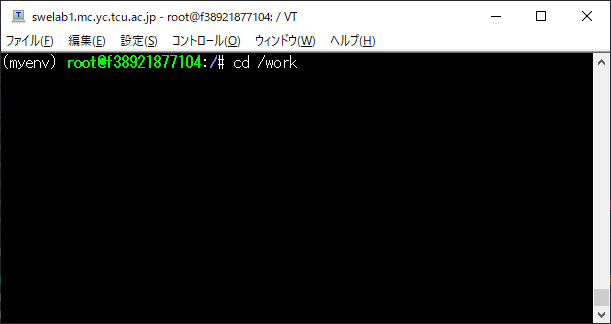
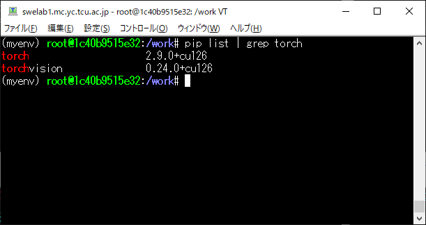
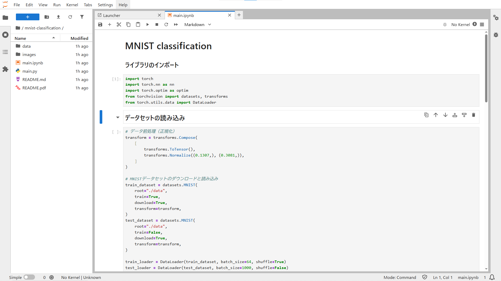
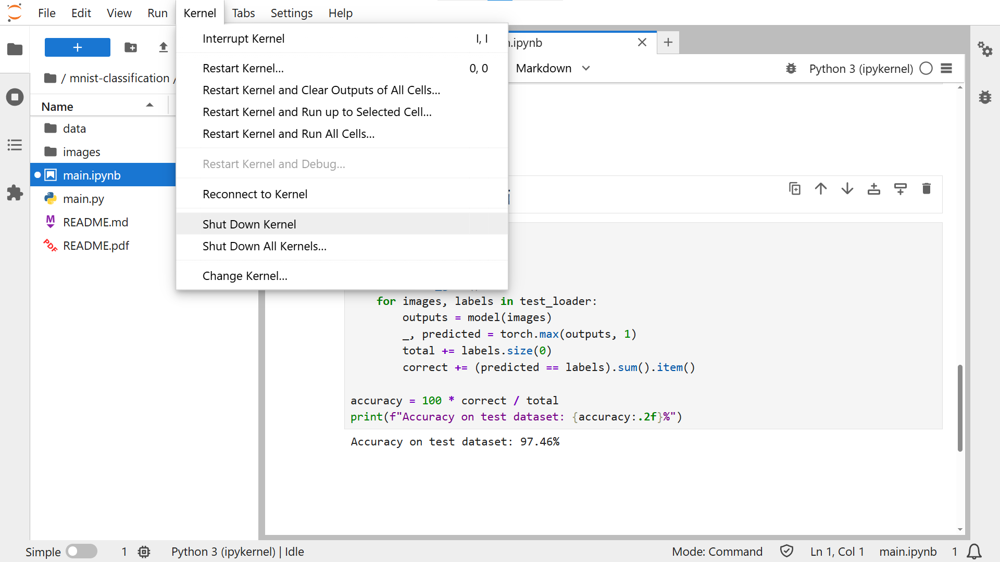

# MNIST classification

<div align="center">
    
</div>
<div align="right">
    出典：Image-Classification-with-MNIST-Dataset-using-keras - GitHub
</div>

<br>
今回はPython深層学習系ライブラリPytorchを使用してMNISTの分類とモデルの評価を行う。

### 深層学習とは
深層学習とは人間の脳の神経回路を模倣した多層構造の「ニューラルネットワーク」を用いて、大量のデータからルールやパターンを学習する機械学習の一種。
### MNISTとは
MNISTとは「Modified National Institute of Standards and Technology database」の略で、手書き数字の画像データセット。機械学習、特にニューラルネットワークを用いた画像認識の入門やベンチマークとして広く利用されている。

<div align="center">
    
</div>
<div align="right">
    出典：IMNIST database - Wikipedia
</div>

### モデルの評価方法
機械学習における代表的な評価指標としてAccuracy, Recall Precision, F1がある。
今回はAccuracyの算出を実際にプログラムを動かして体験してもらう。
| 略称  | 英語名             | 日本語訳   | 意味                       |
|------|------------------|----------|-------------------------------|
| TP   | True Positive    | 真陽性    | 本当は陽性で、予測も陽性と判定した     |
| TN   | True Negative    | 真陰性    | 本当は陰性で、予測も陰性と判定した     |
| FP   | False Positive   | 偽陽性    | 本当は陰性だが、予測は陽性と判定した   |
| FN   | False Negative   | 偽陰性    | 本当は陽性だが、予測は陰性と判定した   |

| 指標            | 日本語訳     | 定義・数式                            | 主な意味・使いどころ                            |
|----------------|------------|-------------------------------------|-------------------------------------------|
| **Accuracy**   | **正解率**   | 　  | **全ての予測のうち正しく予測できたものの割合**       |
| Recall    　　  | 再現率       |        | 実際に正であったもののうち、どれだけ「正」と予測できたか |
| Precision 　　  | 適合率       |  | 「正」と予測したうち、実際に正であった割合           |
| F1-score  　　  | F1スコア     |                | Precision・Recallの調和平均。バランス重視に使う    |

## セットアップ
### Docker環境へSSH接続 & Jupyterの起動
「2025事例研⽣向け 増⽥研究室 サーバー環境の使い⽅」を参照

### リポジトリのクローン
<br>
上記のようなコンソール上でコマンドを打つ
```
cd /work
git clone https://github.com/aiueo5938/mnist-classification.git
cd ./mnist-classification
```

### [Pytorch](https://pytorch.org/get-started/locally/)のインストール

<br>上記のように`pip list | grep torch`とコマンドを打っても、赤文字でインストール済みのライブラリが表示されない場合は下記のコマンドを実行する。
```
python -m pip install --upgrade pip
pip3 install torch torchvision --index-url https://download.pytorch.org/whl/cu126
```

## プログラムの実行
Jupyterを開きmnist-classification/main.ipynbを開く
無事ノートブックが開けたらセルをクリックして`Ctrl+Enter`で実行する


### 実際にプログラムを動かしてみる↓
https://github.com/user-attachments/assets/13179015-a359-43e8-80e0-a8ab431be97a

### GPUメモリの解放
Kernel -> Shut Down Kernelを押してGPUのメモリを解放する
